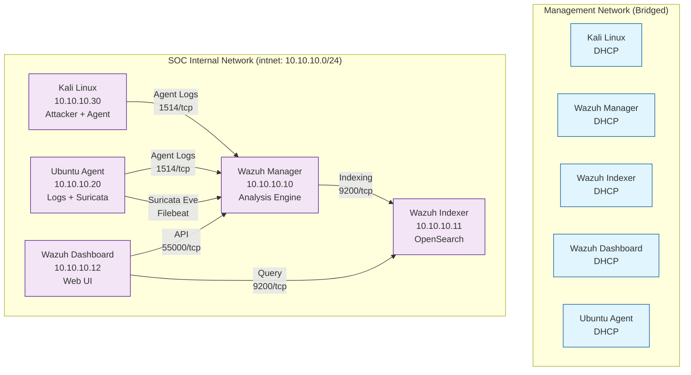

# SOC Monitoring Lab — Architecture Document

## 1. Executive Summary

This document describes the architecture of a complete SOC Monitoring Lab built with **Wazuh SIEM** deployed on **VirtualBox**. The lab simulates a production-grade security operations environment with log collection, analysis, alerting, visualization, and attack simulation capabilities.

---

## 2. High-Level Architecture

```
┌─────────────────────────────────────────────────────────────────────────────────────────┐
│                                    MANAGEMENT NETWORK (Bridged)                          │
│  ┌─────────────┐  ┌─────────────┐  ┌─────────────┐  ┌─────────────┐  ┌─────────────┐   │
│  │   Kali      │  │  Manager    │  │  Indexer    │  │ Dashboard   │  │  Ubuntu     │   │
│  │  (LAN IP)   │  │  (LAN IP)   │  │  (LAN IP)   │  │  (LAN IP)   │  │  Agent      │   │
│  └─────────────┘  └─────────────┘  └─────────────┘  └─────────────┘  └─────────────┘   │
└─────────────────────────────────────────────────────────────────────────────────────────┘
                                         │
                                         ▼
┌─────────────────────────────────────────────────────────────────────────────────────────┐
│                                    INTERNAL NETWORK (intnet)                             │
│  ┌─────────────┐  ┌─────────────┐  ┌─────────────┐  ┌─────────────┐  ┌─────────────┐   │
│  │   Kali      │  │  Manager    │  │  Indexer    │  │ Dashboard   │  │  Ubuntu     │   │
│  │  10.10.10.30│──▶│  10.10.10.10│──▶│  10.10.10.11│◀──│  10.10.10.12│   │  10.10.10.20│   │
│  │  (Agent)    │   │  (Manager)  │   │  (Indexer)  │   │  (Dashboard)│   │  (Agent+IDS)│   │
│  └─────────────┘  └─────────────┘  └─────────────┘  └─────────────┘  └─────────────┘   │
└─────────────────────────────────────────────────────────────────────────────────────────┘
```

---

## 3. Network Design

### 3.1 Network Segments

| Network | CIDR | Purpose | VMs |
|---------|------|---------|-----|
| **Management (Bridged)** | `192.168.x.x/24` (DHCP) | Internet access, host management, OS updates | All VMs |
| **SOC Internal (intnet)** | `10.10.10.0/24` | Isolated SOC traffic: agent→manager, manager→indexer, dashboard→indexer | All VMs |

### 3.2 IP Address Assignment (Static on intnet)

| Hostname | Role | intnet IP | Bridged IP |
|----------|------|-----------|------------|
| `kali-linux` | Attacker + Monitored Endpoint | `10.10.10.30` | DHCP |
| `wazuh-manager` | SIEM Central Manager | `10.10.10.10` | DHCP |
| `wazuh-indexer` | OpenSearch Cluster | `10.10.10.11` | — |
| `wazuh-dashboard` | Web UI (Kibana fork) | `10.10.10.12` | — |
| `ubuntu-agent` | Log Source + Suricata IDS | `10.10.10.20` | — |

### 3.3 Firewall Rules (UFW on each VM)

```bash
# Manager (10.10.10.10)
ufw allow from 10.10.10.0/24 to any port 1514 proto tcp   # Agent enrollment
ufw allow from 10.10.10.0/24 to any port 1515 proto tcp   # Agent auth
ufw allow from 10.10.10.0/24 to any port 514 proto udp    # Syslog
ufw allow from 10.10.10.0/24 to any port 9200 proto tcp   # Indexer API

# Indexer (10.10.10.11)
ufw allow from 10.10.10.0/24 to any port 9200 proto tcp   # OpenSearch
ufw allow from 10.10.10.0/24 to any port 9300 proto tcp   # Transport

# Dashboard (10.10.10.12)
ufw allow from 10.10.10.0/24 to any port 5601 proto tcp   # Web UI
ufw allow from 10.10.10.0/24 to any port 9200 proto tcp   # Indexer

# Ubuntu Agent (10.10.10.20)
ufw allow from 10.10.10.0/24 to any port 22 proto tcp     # SSH for attacks
ufw allow from 10.10.10.0/24 to any port 80 proto tcp     # Web for attacks

# Kali (10.10.10.30)
ufw allow from 10.10.10.0/24 to any port 22 proto tcp     # SSH
```

---

## 4. Component Specifications

### 4.1 VM Resource Allocation

| VM | vCPU | RAM | Disk | OS | Purpose |
|----|------|-----|------|-----|---------|
| `kali-linux` | 8 | 4 GB | 40 GB | Kali 2026.2 | Attacker + Wazuh Agent |
| `wazuh-manager` | 2 | 4 GB | 40 GB | Ubuntu 22.04 | Log analysis, correlation |
| `wazuh-indexer` | 2 | 6 GB | 60 GB | Ubuntu 22.04 | OpenSearch storage |
| `wazuh-dashboard` | 1 | 2 GB | 20 GB | Ubuntu 22.04 | Visualization UI |
| `ubuntu-agent` | 1 | 2 GB | 20 GB | Ubuntu 22.04 | Log source + Suricata |

**Total:** 14 vCPU, 14 GB RAM, 180 GB Disk

### 4.2 Software Versions (Pinned)

| Component | Version | Source |
|-----------|---------|--------|
| Wazuh Manager | 4.9.2 | packages.wazuh.com |
| Wazuh Indexer | 4.9.2 | packages.wazuh.com |
| Wazuh Dashboard | 4.9.2 | packages.wazuh.com |
| Wazuh Agent | 4.9.2 | packages.wazuh.com |
| Filebeat | 8.11 | elastic.co |
| Suricata | 7.0 | suricata.io (Ubuntu repo) |
| OpenSearch | 2.11 | Embedded in Wazuh Indexer |
| Ansible | 2.14+ | Control machine |

---

## 5. Data Flow

### 5.1 Log Collection Flow

```
┌─────────────┐     ┌──────────────┐     ┌────────────────┐     ┌────────────────┐
│   Endpoint  │     │   Wazuh      │     │   Wazuh        │     │   Wazuh        │
│   (Agent)   │────▶│   Manager    │────▶│   Indexer      │────▶│   Dashboard    │
│             │     │  (Analysis)  │     │  (OpenSearch)  │     │  (Visualize)   │
└─────────────┘     └──────────────┘     └────────────────┘     └────────────────┘
       │                   │                    │                    │
       │                   │                    │                    │
       ▼                   ▼                    ▼                    ▼
  ┌─────────┐        ┌───────────┐        ┌───────────┐        ┌───────────┐
  │ Syslog  │        │ Decoders  │        │  Index    │        │  Dash-    │
  │ Auth    │   →    │ Rules     │   →    │  Shards   │   →    │  boards   │
  │ Auditd  │        │ Alerts    │        │  Replicas │        │  Alerts   │
  │ Journal │        │ MITRE     │        │  ILM      │        │  Cases    │
  └─────────┘        └───────────┘        └───────────┘        └───────────┘
```

### 5.2 Network Traffic Flow (Suricata)

```
┌─────────────┐     ┌──────────────┐     ┌────────────────┐     ┌────────────────┐
│   Network   │     │   Suricata   │     │   Filebeat     │     │   Wazuh        │
│   Traffic   │────▶│   (IDS)      │────▶│   (Shipper)    │────▶│   Manager      │
│   (SPAN/TAP)│     │  Eve JSON    │     │  → Logstash/   │     │  (Correlation) │
└─────────────┘     └──────────────┘     │  → Manager     │     └────────────────┘
                                         └────────────────┘
```

### 5.3 Alert Flow

```
Rule Match
    │
    ▼
┌────────────────┐
│  Wazuh Manager │
│  - Alert Gen   │
│  - MITRE Tag   │
│  - Enrichment  │
└───────┬────────┘
        │
        ▼
┌────────────────┐     ┌────────────────┐     ┌────────────────┐
│  Indexer       │────▶│  Dashboard     │────▶│  Notification  │
│  (Storage)     │     │  (Real-time)   │     │  (Email/Slack) │
└────────────────┘     └────────────────┘     └────────────────┘
```

---

## 6. Wazuh Component Details

### 6.1 Wazuh Manager (`wazuh-manager`)

**Role:** Central analysis engine

**Key Configuration (`/var/ossec/etc/ossec.conf`):**
```xml
<ossec_config>
  <global>
    <json_output>yes</json_output>
    <alerts_log>yes</alerts_log>
    <logall>no</logall>
    <logall_json>no</logall_json>
    <email_notification>yes</email_notification>
    <smtp_server>smtp.gmail.com</smtp_server>
    <email_from>wazuh@lab.local</email_from>
    <email_to>analyst@lab.local</email_to>
  </global>

  <rules>
    <include>ruleset/rules/*.xml</include>
    <include>ruleset/local_rules.xml</include>  <!-- Custom rules -->
  </rules>

  <auth>
    <disabled>no</disabled>
    <port>1515</port>
    <use_source_ip>yes</use_source_ip>
    <force_insert>yes</force_insert>
    <force_time>0</force_time>
    <purge>yes</purge>
    <use_password>no</use_password>
    <ssl_agent_ca>/var/ossec/etc/sslmanager.cert</ssl_agent_ca>
    <ssl_agent_cert>/var/ossec/etc/sslmanager.cert</ssl_agent_cert>
    <ssl_agent_key>/var/ossec/etc/sslmanager.key</ssl_agent_key>
    <ciphers>HIGH:!ADH:!EXP:!MD5:!RC4:!3DES:!CAMELLIA:@STRENGTH</ciphers>
  </auth>

  <cluster>
    <name>wazuh-cluster</name>
    <node_name>manager-01</node_name>
    <node_type>master</node_type>
    <key>wazuh-cluster-key</key>
    <interval>2s</interval>
    <port>1516</port>
    <bind_addr>10.10.10.10</bind_addr>
    <nodes>
      <node>10.10.10.10</node>
    </nodes>
    <hidden>no</hidden>
    <disabled>no</disabled>
  </cluster>
</ossec_config>
```

**Ports:**
- `1514/tcp` — Agent registration & log forwarding
- `1515/tcp` — Agent authentication (agent-auth)
- `1516/tcp` — Cluster communication
- `514/udp` — Syslog reception
- `55000/tcp` — Wazuh API (REST)

### 6.2 Wazuh Indexer (`wazuh-indexer`)

**Role:** OpenSearch cluster for log storage & search

**Key Configuration (`/etc/wazuh-indexer/opensearch.yml`):**
```yaml
cluster.name: wazuh-cluster
node.name: indexer-01
network.host: 10.10.10.11
http.port: 9200
transport.port: 9300
discovery.type: single-node

# Security
plugins.security.enabled: true
plugins.security.ssl.transport.enabled: true
plugins.security.ssl.http.enabled: true
plugins.security.authcz.admin_dn:
  - "CN=admin,OU=Wazuh,O=Wazuh,L=California,C=US"

# Performance
bootstrap.memory_lock: true
indices.memory.index_buffer_size: 30%
indices.memory.min_index_buffer_size: 96mb

# Index Lifecycle Management
plugins.index_state_management.enabled: true
```

**JVM Heap:** `-Xms3g -Xmx3g` (50% of 6 GB RAM)

**Ports:**
- `9200/tcp` — REST API (HTTPS)
- `9300/tcp` — Transport protocol

### 6.3 Wazuh Dashboard (`wazuh-dashboard`)

**Role:** Visualization & investigation UI (Kibana fork)

**Key Configuration (`/etc/wazuh-dashboard/opensearch_dashboards.yml`):**
```yaml
server.host: "0.0.0.0"
server.port: 5601
server.ssl.enabled: true
server.ssl.certificate: /etc/wazuh-dashboard/certs/dashboard.pem
server.ssl.key: /etc/wazuh-dashboard/certs/dashboard.key

opensearch.hosts: ["https://10.10.10.11:9200"]
opensearch.ssl.verificationMode: certificate
opensearch.username: "admin"
opensearch.password: "${DASHBOARD_PASSWORD}"

opensearch.requestHeadersAllowlist: ["authorization", "securitytenant"]

# Wazuh plugin
wazuh.api.url: "https://10.10.10.10:55000"
wazuh.api.username: "wazuh-wui"
wazuh.api.password: "${WAZUH_API_PASSWORD}"
```

**Ports:**
- `5601/tcp` — Web UI (HTTPS)

### 6.4 Wazuh Agent (on `ubuntu-agent` & `kali-linux`)

**Role:** Log collection & forwarding

**Key Configuration (`/var/ossec/etc/ossec.conf`):**
```xml
<ossec_config>
  <client>
    <server>
      <address>10.10.10.10</address>
      <port>1514</port>
      <protocol>tcp</protocol>
    </server>
    <config-profile>ubuntu,linux</config-profile>
    <notify_time>10</notify_time>
    <time-reconnect>60</time-reconnect>
    <auto_restart>yes</auto_restart>
  </client>

  <syscheck>
    <frequency>43200</frequency>
    <directories>/etc,/usr/bin,/usr/sbin</directories>
    <directories>/bin,/sbin</directories>
    <ignore>/etc/mtab</ignore>
    <ignore>/etc/hosts.deny</ignore>
    <ignore>/etc/mail/statistics</ignore>
    <ignore>/etc/random-seed</ignore>
    <ignore>/etc/random.seed</ignore>
    <ignore>/etc/adjtime</ignore>
    <ignore>/etc/httpd/logs</ignore>
    <ignore>/etc/utmpx</ignore>
    <ignore>/etc/wtmpx</ignore>
    <ignore>/etc/cups/certs</ignore>
    <ignore>/etc/dumpdates</ignore>
    <ignore>/etc/svc/volatile</ignore>
  </syscheck>

  <rootcheck>
    <frequency>43200</frequency>
  </rootcheck>

  <wodle name="open-scap">
    <disabled>yes</disabled>
  </wodle>

  <wodle name="cis-cat">
    <disabled>yes</disabled>
  </wodle>

  <wodle name="aws-s3">
    <disabled>yes</disabled>
  </wodle>

  <wodle name="azure-logs">
    <disabled>yes</disabled>
  </wodle>

  <wodle name="gcp-pubsub">
    <disabled>yes</disabled>
  </wodle>

  <wodle name="osquery">
    <disabled>yes</disabled>
  </wodle>

  <localfile>
    <log_format>syslog</log_format>
    <location>/var/log/auth.log</location>
  </localfile>
  <localfile>
    <log_format>syslog</log_format>
    <location>/var/log/syslog</location>
  </localfile>
  <localfile>
    <log_format>syslog</log_format>
    <location>/var/log/dpkg.log</location>
  </localfile>
  <localfile>
    <log_format>syslog</log_format>
    <location>/var/log/apt/history.log</location>
  </localfile>
  <localfile>
    <log_format>audit</log_format>
    <location>/var/log/audit/audit.log</location>
  </localfile>
  <localfile>
    <log_format>journalctl</log_format>
    <location>systemd</location>
  </localfile>
</ossec_config>
```

**Ports:**
- `1514/tcp` → Manager (outbound)

---

## 7. Suricata IDS (`ubuntu-agent`)

### 7.1 Deployment Mode
- **Interface:** `eth1` (intnet: 10.10.10.20)
- **Mode:** IDS (passive, copy mode via AF_PACKET)
- **Traffic:** All east-west traffic on intnet

### 7.2 Key Configuration (`/etc/suricata/suricata.yaml`)
```yaml
af-packet:
  - interface: eth1
    cluster-id: 99
    cluster-type: cluster_flow
    defrag: yes
    use-mmap: yes
    tpacket-v3: yes

outputs:
  - eve-log:
      enabled: yes
      filetype: regular
      filename: /var/log/suricata/eve.json
      types:
        - alert:
            payload: yes
            payload-printable: yes
            packet: yes
            metadata: yes
        - http:
            extended: yes
        - dns:
            query: yes
            answer: yes
        - tls:
            extended: yes
        - files:
            force-magic: no
            force-hash: [md5, sha1, sha256]
        - ssh
        - smtp
        - flow

rule-files:
  - suricata.rules
  - /etc/suricata/rules/*.rules

default-rule-path: /etc/suricata/rules
```

### 7.3 Filebeat → Wazuh Manager
```yaml
# /etc/filebeat/modules.d/wazuh.yml
module: wazuh
alerts:
  enabled: true
  var.paths: ["/var/log/suricata/eve.json"]
  var.input: "log"
```

---

## 8. Security Controls

### 8.1 TLS/SSL Everywhere
- Manager ↔ Indexer: Mutual TLS (mTLS)
- Dashboard ↔ Indexer: TLS with cert verification
- Agent ↔ Manager: TLS (auth via agent-auth)
- Dashboard UI: HTTPS (self-signed CA)

### 8.2 Authentication
| Component | Auth Method |
|-----------|-------------|
| Manager API | Basic auth (wazuh-wui user) |
| Indexer | Security plugin (admin cert) |
| Dashboard | OpenSearch Security (admin/user) |
| Agent Enrollment | agent-auth with pre-shared key |

### 8.3 Credentials Management
- All passwords stored in `ansible/group_vars/all.yml` (encrypted with ansible-vault in production)
- Certificates generated by `wazuh-indexer-certs-tool` and `wazuh-manager-certs-tool`
- No hardcoded secrets in repository

---

## 9. Monitoring & Observability

### 9.1 Health Checks
- **Cluster Health:** `GET https://10.10.10.11:9200/_cluster/health`
- **Agent Status:** `GET https://10.10.10.10:55000/agents`
- **Indexer Disk:** `GET https://10.10.10.11:9200/_cat/allocation?v`
- **Manager Queue:** `GET https://10.10.10.10:55000/manager/stats/hourly`

### 9.2 Key Metrics
| Metric | Threshold | Action |
|--------|-----------|--------|
| Indexer disk usage | >80% | Trigger ILM rollover / add disk |
| Agent disconnected | >5 min | Alert / investigate |
| Manager queue size | >10k events | Scale manager / check indexer |
| Dashboard latency | >5s | Check indexer health |

---

## 10. Backup & Disaster Recovery

### 10.1 Indexer Snapshots
```bash
# Register repository
PUT /_snapshot/wazuh-backup
{
  "type": "fs",
  "settings": {
    "location": "/mnt/backups/wazuh",
    "compress": true
  }
}

# Daily snapshot (via cron)
PUT /_snapshot/wazuh-backup/snapshot-%Y%m%d
{
  "indices": "wazuh-alerts-*,wazuh-archives-*",
  "ignore_unavailable": true,
  "include_global_state": false
}
```

### 10.2 Configuration Backup
- Ansible playbooks = Infrastructure as Code (git-backed)
- Wazuh configs: `/var/ossec/etc/` backed up via Ansible
- Certificates: Re-generatable via cert tools

### 10.3 RTO/RPO
| Scenario | RTO | RPO |
|----------|-----|-----|
| Manager failure | 15 min | 0 (stateless) |
| Indexer failure | 30 min | 24h (daily snapshot) |
| Dashboard failure | 10 min | 0 (stateless) |
| Agent failure | 5 min | 0 (re-enroll) |

---

## 11. Scaling Considerations

### 11.1 Horizontal Scaling
- **Indexer:** Add data nodes → `discovery.seed_hosts` + `cluster.initial_master_nodes`
- **Manager:** Add worker nodes → `cluster.nodes` in ossec.conf
- **Agents:** Auto-distribute via Manager affinity

### 11.2 Vertical Scaling (Current Lab)
| Component | Current | Max (Single Node) |
|-----------|---------|-------------------|
| Indexer heap | 3 GB | 31 GB (50% RAM) |
| Manager agents | 5 | 14,000+ |
| Events/sec | ~500 | 10,000+ |

---

## 12. Future Enhancements

| Enhancement | Effort | Value |
|-------------|--------|-------|
| TheHive + Cortex SOAR | Medium | Automated response |
| Windows Agent + Sysmon | Low | Cross-platform coverage |
| Cloud log sources (AWS/Azure) | Medium | Hybrid visibility |
| Sigma rule conversion | Low | Standardized detections |
| Multi-cluster federation | High | Enterprise scale |
| GPU-accelerated ML | High | Anomaly detection |

---

## 13. Diagram Source (Mermaid)



---

*Document Version: 1.0*  
*Last Updated: 2026-09-13*  
*Author: Hariom Raut*